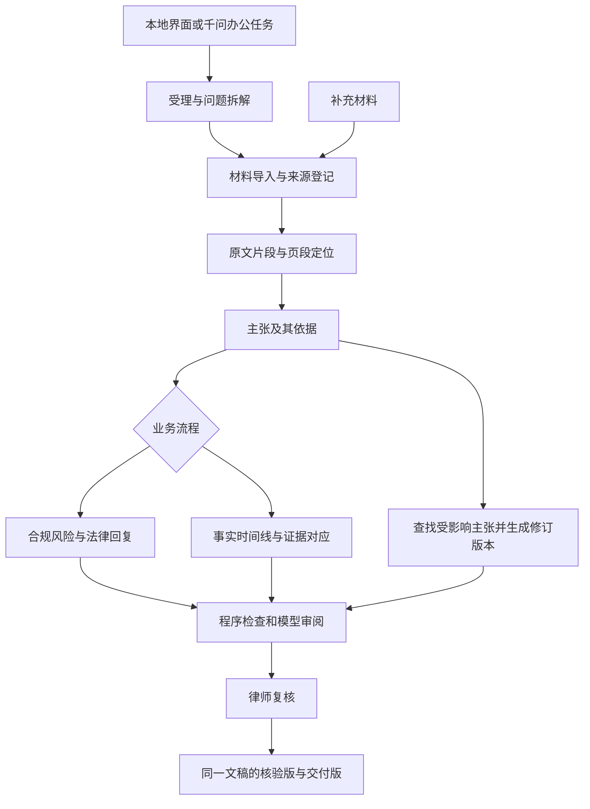

# LexPrism 评估与本地框架建议

> 后续用户已纠正产品方向：香港问题只是专家评测样例，不定义业务范围；GUI暂缓，千问办公为优先运行环境；国内检索优先接用户提供的北大法宝MCP。本文保留为首轮评估记录，其中场景收窄、本地GUI及自建总调度建议已被取代。当前建设依据请读 [Agent框架](Agent框架.md)、[开发计划](开发计划.md)和[海外法律数据接入评估](海外法律数据接入评估.md)。

评估日期：2026-09-08。本文为架构与产品建议，尚未实施应用、调用千问 API 或完成平台部署。用户已确认：已报名，尚无千问办公权限。

## 1. 结论

建议继续做，定位为“面向涉外企业法律工作的、可追溯的研究与风险文书工作台”，以可移植 Skill 包承载律师方法，以本地执行程序承载材料处理、引用校验、版本管理和人工复核。

70% 投入非诉与风险管理：围绕一个法律问题，拆解研究范围、整理有效来源、识别适用条件，生成有依据的合规义务清单及法律回复。30% 投入争议与证据工作：复用同一材料底座，生成事实时间线、争点与证据对应表及缺口清单。比例用于业务范围、演示和验收案例分配，不必机械拆成七个与三个 Skill。

第一版主打“带引用核验的涉外合规研究与法律回复”；争议侧只做到材料整理和证据关联。以云端现有“香港注册非香港公司”示例为首个验收场景。职业大学海外办学、美国法院与中国通缉背景的问题保留为后续复杂场景，不要求首版承诺准确覆盖所有法域。

核心竞争点应是：每个关键结论能回到原文；法域、时间、适用条件能追踪；补充材料后能展示哪些结论发生变化；律师能快速复核并拿到符合工作习惯的文书。

## 2. 已核对材料与赛事约束

### 2.1 材料范围

- 云端 [LexPrism](https://docs.google.com/document/d/1AMiwVu8vzMgPluXpFTyu3kwwEWuFWrXAt4NdMz89DCY/edit)：本轮读取的版本修改时间为 2026-09-08 14:02:49（UTC+8）。内容包括需求、三个示例问题、一个展开的香港公司示例答案，以及 a—m 共十三项反馈。方案与工作流、开发进度、测试与问题尚未填入实现证据。
- 本地 [律师提示词汇编](../律师提示词/律师提示词汇编.md)：读取五份提示词的汇编文本，未打开其他 DOCX。源文件 SHA-256：`377C15A341FE90EFB39D5C8D978588F40A9FE35522300237959FEA258B1601E5`。
- Gmail [转发：大成折耳根×千问办公法律 Skills 大赛报名通知](https://mail.google.com/mail/#all/1a07b087d48c7099)：原通知日期 2026-09-04，转发日期 2026-09-07。赛事正文在邮件内，没有独立文档附件；正文图片不影响本轮已读取的规则。
- 本地目录当前可见的是 Git 目录及律师提示词材料，尚无应用代码或测试结果。因此现阶段有需求与提示词资产，不能称为已有可运行法律 Agent。

本轮对示例做的是需求符合性审查与少量来源抽查，并非整份香港法律意见的全面法律核验。未核实的条文、期限及法律结论不能因被本文讨论而视为已验证。

### 2.2 赛事对架构的实际影响

根据上述邮件：

| 规则 | 对本项目的影响 |
| --- | --- |
| 2026-09-20 13:00—18:00 比赛，9月8日报名截止 | 已报名；后续需尽早开通平台权限并获取演示安排 |
| 作品须在千问办公完成部署与场景验证 | 本地 GUI 加百炼 API 只能证明本地版本运行，仍须平台实测 |
| 一个核心 Skill 或多个 Skills 组合均可 | 可先完成核心闭环，不必为数量拆分技能 |
| 实际价值40分、设计与可用性40分、创新与展示20分 | 应优先投入材料质量、输出稳定性和复核效率 |
| 智能体／系统额外最多20分 | 连续执行、明确交接、稳定结果比增加角色数量更有价值 |
| 3分钟内说明真实场景、能力和效果；评委可换输入重跑 | 必须准备现场重新执行与异常处理，不能只演示固定答案 |
| 原创或披露开源基础并做实质优化 | 记录引用项目、版本、许可及自己的新增能力 |

邮件只提到需符合赛事安全要求，未完整列出具体数据规则；账号开通时一并索取。当前无需替用户报名、发邮件或联系主办方。

## 3. 现有文档评估

### 3.1 最有价值的基础

需求抓到了法律工作的主要难点：信息可信度、精确引注、现行效力、反向案例、问题拆解、文书适配和律师复核。尤其是“原文—总结—在文书中如何使用”的对照要求，可以直接成为产品主界面。

提示词中的“只取本次材料”“找不到就说明”“范文只学结构、不复制案情”很适合沉淀成通用规则。云端提出的补充材料、局部改写与纯净版切换也是真实工作需求。

### 3.2 五份提示词如何复用

| 提示词 | 可沉淀能力 | 首版需要调整的部分 |
| --- | --- | --- |
| 法律回复意见起草 | 材料限定写作、规范引用、条件式建议、律所文风 | 四步段落不能强迫每节都有案例；缺案例时省略该步骤并标明依据范围；范文为单独输入 |
| 法律检索结论汇总 | 按问题组织、多法域区分、依据先于结论 | 增加问题清单、来源编号、效力状态、结论支持关系和缺口输出 |
| 法律咨询助手 | 官方优先检索、双语解释、法域标注 | “默认不研究中国法”和英文优先不能成为全部项目默认；去除与严肃文书无关的个性化角色风格 |
| 特殊案例类型检索 | 案例卡片、覆盖检查、来源精确定位 | “近五年”“今年”改成明确日期参数；缺事实保留空缺，不为凑齐案例字段补造细节 |
| 原产地规则写作 | 法域手册、模板模仿、章节查重、官方材料研究 | 四份知识库依赖尚未提供；与历史章节的引用关系须显式存储；先作为专业扩展包 |

写在提示词里的 `legal_research()` 等函数名，不代表已有联网或数据库能力；执行环境必须实际提供对应工具。完整汇编也不应一次性塞进所有任务上下文，否则来源限制、语言优先和文书结构会相互冲突。

### 3.3 需要先讨论清楚的规则

1. **来源等级与语言质量拆开。** 建议保留 T1/T2/T3 作为来源层级，同时新增原文语言、是否官方译本、是否机器翻译、是否人工核对。法语官方法规不应仅因没有英文版而与律所文章混为一个权威层级。若律师希望保留“译文降级”，可另记译文可信度，不改动原文的来源属性。此为建议，尚未修改云端原规则。
2. **同为 T1 不代表同等法律作用。** 法条、行政问答、判决应分别记录来源类型、制定／审判主体、适用法域、法律作用与状态。官网问答不能自动等同于法条；判决相关语句也不能只看是否位于 conclusion 段。
3. **时间与适用性分开。** 发布日期、施行日期、废止日期、研究基准日和抓取日期各有用途。“新判例”不能仅按日期替代旧判例，需核对法院层级、适用法域、审级和具体处理关系。
4. **原始事实、法律依据、写作范例分库存放。** 当事人材料不能仅用 T1/T2/T3 评价证据可信性；应记录是谁提供、是否签署、是否完整、是否与其他材料冲突。范文中的事实与结论不得进入本案事实库。
5. **两种来源模式明确切换。** `仅本次材料` 用于受控写作与稳定回放；`允许新增检索` 用于补全研究。新搜到的资料先登记、核验、纳入批准来源集，再供起草使用。
6. **忠实引用与法律推理分开。** 逐字引文需要精确一致；法律分析可以推理，但必须列明事实前提、规则依据、推理关系和不确定性。把所有分析都定义为“禁止推断”会与法律适用工作本身冲突。
7. **样式要求由文书类型决定。** 正式意见正文采用自然段、中文术语和统一编号；核验页、证据目录、合规任务清单允许表格。香港材料应核对实际官方中文文本，不把自行繁简转换或机器翻译标为官方简体原文。
8. **免责语句只是交付模板的一部分。** 不能用一句免责说明替代版本核验、缺口披露和实际复核记录。

### 3.4 香港示例的具体评价

这份示例已经有主体身份区分、持续义务分类和来源目录，也注意到部分义务有适用前提，值得保留。但它目前更像研究草稿，尚未达到你们自己规定的交付标准。

| 观察 | 证据与含义 | 对应改进 |
| --- | --- | --- |
| 部分引注过宽 | 开头结论引用 Part 16 或一个网站小节；尾注中也有跨多条法规的组合依据 | 一项主张分别绑定具体条／款／句与原文，不以长来源清单替代逐项支持 |
| 依赖历史法规文本 | 实际下载的 Part 16 PDF 第1页标为2012年第28号条例，第27页仍包含第792条原文 | 登记为历史制定文本，需与现行综合文本和修订沿革交叉核验，不能仅因域名官方就标“现行有效” |
| 示例并非完全忽视修订 | 示例已经提到第792条废除及2025年修订 | 应保留该优点，但把零散人工说明升级成逐来源的版本状态；本轮不据此断言整份结论错误 |
| 脚注25有真实支撑，但定位不足 | 对《重要控制人登记册指引》的纯文本抽取未找到有关语句；查看附录G第62页的 NR2 表格图像后，确有关于两类公司适用的括注 | 这是扫描／图像型页面漏检问题，不宜误报为虚假引用；补“附录G，第62页，NR2，第2A项”并保留图像定位 |
| 自然语言质量不符合已记录反馈 | a—m反馈集中于英语未解释、格式混杂、概念突兀、要点过碎、结论不便执行 | 将十三项反馈转成文风规则及验收项；术语表、编号与引注格式由渲染层控制 |
| 缺少真正可执行的短结论 | “最终检索结论”再次汇总长段落，具体事项与前提不易快速核对 | 按“具体义务—适用前提—行动／时间—依据—待确认事项”输出工作清单；正文仍用正式自然段 |
| 未见逐项复核记录 | 有尾注和来源目录，没有每个主张的核验状态、原文对照及版本变更记录 | 增加核验视图和修改历史，纯净版由同一结构化内容生成 |

抽查来源：[Part 16 官方 PDF](https://www.cr.gov.hk/en/companies_ordinance/docs/part16-e.pdf)、[重要控制人登记册指引](https://www.cr.gov.hk/en/publications/docs/Guidelines_scr_e.pdf)。现行法规入口为[香港电子法例](https://www.elegislation.gov.hk/hk/cap622)，本轮自动访问受到客户端检查限制，未取得完整现行文本，未完成逐条现行效力比对。

不建议给这一个示例虚构“准确率”。更适合将它连同原始材料、十三项反馈和律师修订后的答案一起作为首个回归测试案例。

## 4. 当前开源实现：可借鉴什么

截至本轮公开检索与仓库读取，以下项目可作为候选。此次未克隆、安装或基准测试这些框架，功能描述来自原维护者文档；选型是针对 LexPrism 的判断。

| 项目 | 已有能力及许可信息 | 对 LexPrism 的用途与限制 |
| --- | --- | --- |
| [Agent Skills 标准](https://agentskills.io/specification) | 以 SKILL.md 及可选 scripts、references、assets 组织可复用技能 | 作为可移植的内容格式；它不提供模型、检索器或执行沙箱，也不保证不同宿主行为一致 |
| [Qwen-Agent](https://github.com/QwenLM/Qwen-Agent) | Apache-2.0；千问工具调用、MCP、RAG和 Gradio 界面示例 | 适合验证千问工具接入。引用核验、任务恢复、法律版本关系仍需项目自己实现；接千问 API 不以使用此框架为前提 |
| [LangGraph](https://docs.langchain.com/oss/python/langgraph/overview) | 仓库为 MIT；支持持久化、人工介入、确定步骤与模型步骤混合 | 适合作为本地流程控制，特别是补材料、复核暂停、失败恢复。无需同时引入另一套总调度框架 |
| [Claude for Legal](https://github.com/anthropics/claude-for-legal) | Apache-2.0；按商业、公司、用工、诉讼等领域提供插件、技能和连接器参考 | 借鉴领域配置、任务路由、时间线、版本差异及律师复核。其宿主路径、工具和法域规则不能直接移植到千问／中国法律场景 |
| [Knowledge Work Plugins / legal](https://github.com/anthropics/knowledge-work-plugins/tree/main/legal) | 有合同审查、NDA分级、合规、风险评估及固定答复流程 | 可借鉴“律所自己的审查规则与风险偏好”。不能照搬示例中的期限、法域或默认合同立场作为本项目法律结论 |
| [RAGFlow](https://github.com/infiniflow/ragflow) | Apache-2.0；以文档理解、检索和 Agent 能力组织知识工作 | 大规模文档与 OCR 增多后再评估。首个小规模受控材料流程不必先部署整个系统；检索命中也不能代替法律适用性核验 |
| [Dify](https://github.com/langgenius/dify) | 可视化工作流、模型和知识库集成；[许可含附加条件](https://github.com/langgenius/dify/blob/main/LICENSE) | 适合快速拼装业务流程；本项目逐句证据定位与增量改写需要定制。采用其前端或多租户服务时需具体复查许可条件，不称为纯 Apache-2.0 |

已进一步阅读两个实际技能：

- [commercial-legal / review](https://github.com/anthropics/claude-for-legal/blob/main/commercial-legal/skills/review/SKILL.md) 先读机构的审查规则，再依据主合同与附件结构选择子技能；这对“不同文书不能用同一套结构”很有参考价值。
- [litigation-legal / chronology](https://github.com/anthropics/claude-for-legal/blob/main/litigation-legal/skills/chronology/SKILL.md) 区分材料来源、去重、事件重要性与版本差异；适合借鉴事实时间线工作方法，涉及其特定法域的程序规则需重新审定。

这些项目表明通用编排和技能封装已有可用基础。没有证据表明任一项目已自动满足你们的涉外法律有效性、中文文书与逐句溯源要求。应复用通用工具，自己掌握证据模型和质量控制。

## 5. 推荐的首版业务边界

### 5.1 非诉与风险管理，约70%

完成一条完整流程：主题受理 → 问题拆解 → 资料整理／受控检索 → 规则与条件整理 → 合规义务及风险清单 → 法律回复或检索结论 → 引用核验 → 律师复核 → 导出。

首版产物：

- 一份精炼的合规义务／风险清单。
- 一份中文法律回复或法律检索结论，具体模板由律师选择。
- 一份逐项引用对照表及未解决事项清单。

合同审查先限于律师提供的条款标准和明确风险清单；全面尽调、完整多国合规数据库、原产地国别手册批量生成列为扩展。

### 5.2 争议解决与证据，约30%

输入若干经授权的材料，输出事实时间线、证据目录、争点—待证事实—支持／反对材料对应表。每个事件保留材料编号、页段、事件时间与材料形成时间，冲突日期不能自动合并。

明确区分“材料记载／当事人主张”和“已被裁判确认的事实”。真实性、合法性、关联性只生成核验问题及辅助分析，不自动认证证据。第一版不承诺胜诉预测、自动立案或完整庭审策略。

争议侧需要律师另给至少一组去敏材料；当前仅有提示词和研究示例，未见可用于验收证据时间线的案件材料包。

### 5.3 建议的技能拆分

| 技能 | 输入 | 输出 |
| --- | --- | --- |
| matter-intake | 主题、对象、法域、目的、材料 | 任务范围、基准日期、问题树、缺失信息 |
| source-research | 问题树、来源模式 | 来源记录、相关原文、检索日志、覆盖缺口 |
| compliance-review | 来源、事实、律师规则 | 义务、前提、风险及建议行动 |
| legal-draft | 已核验主张、文书类型、样式范例 | 法律回复或检索结论草稿 |
| evidence-map | 案件材料、争点 | 时间线、证据目录、冲突与缺口 |
| citation-audit | 草稿主张与来源片段 | 定位／引文检查、语义支持审阅、待人工复核项 |

“补充材料影响分析”和“导出”先作为共享流程，避免所有功能都增加一个独立 Agent。写作与审阅可分别调用模型，但由同一流程控制步骤和状态。

## 6. 本地架构及 GUI

推荐 Python 业务核心 + LangGraph 明确流程 + 千问 API 适配层 + SQLite／本地文件 + 简单 Gradio 界面。GUI 先满足材料上传、任务状态、引用对照与导出，业务逻辑保持独立，之后需要更复杂交互时再换 FastAPI + 专门前端。

Qwen-Agent 可以作为工具调用参考或独立适配器；第一版不建议让 Qwen-Agent、LangGraph、Dify 同时负责总流程。首个流程若足够短，也可以先用显式 Python 步骤函数实现，再在需要恢复与暂停时接 LangGraph。



千问办公与本地共享的是技能方法、数据格式、模板及可兼容的脚本；平台运行时能否直接运行这些脚本、访问文件及调用外部工具，需要账号内验证。上图表示逻辑架构，不表示两端现已互通。

GUI建议三栏：左侧材料和研究范围，中间文书／时间线，右侧当前句子的原文、来源状态、分析关系及复核意见。提供“核验视图／交付视图”和“补充材料后查看变更”。界面显示任务摘要、证据与检查结果，无需展示模型内部思考过程。

### 6.1 数据设计应先于聊天界面

| 对象 | 至少保留的字段 |
| --- | --- |
| Matter | 项目ID、任务类型、法域、读者、问题、研究基准日、来源模式 |
| Document | 文件ID、项目ID、来源／提供人、文档角色、原始文件哈希、版本、访问范围 |
| Source | 官方／专业机构等属性、来源类型、语言、URL、抓取时间、施行／废止信息、核验状态 |
| Passage | 片段ID、来源ID、原文、PDF实际页／印刷页、条款段落、字符位置；图像页另留坐标及OCR状态 |
| Claim | 主张ID、类型（事实／规则／分析／建议）、表述、事实前提、支持及反对片段ID、审核状态 |
| Finding | 义务或风险、适用条件、行动、依据主张、缺口 |
| Draft | 文稿版本、稳定段落ID、关联主张、文书模板、改动与复核记录 |
| Run | 运行ID、模型与参数、技能版本、输入版本、步骤结果、失败、耗时与用量 |

补充材料时沿 Passage → Claim → Draft 的关系找受影响内容；失效或冲突材料应触发重新审阅相关结论。不要只做相似段落润色：新材料可能推翻原先结论、改变问题树，或影响多处段落。

资料少时先用可枚举材料清单、关键词检索和人工选取片段。后续资料规模确实需要时再加混合检索和向量库；向量库不负责条款版本和法律适用关系。

### 6.2 引用核验如何落地

程序检查：来源ID存在、原文片段确实存在、页段位置可回找、引文逐字匹配、所有关键主张有支持记录、引用编号完整、链接与归档记录一致。保留原文，同时另有可审计的规范化匹配规则处理空格和换行；实质改写不能伪装成逐字引用。

模型审阅：原文是否真正支持该主张、是否遗漏例外、是否把必要条件说成充分条件、是否混淆法域／主体、是否忽视反向材料。审阅调用应读取原始片段、前后文及相反依据，不能只看上一模型给出的总结。

律师复核：确认法律适用、关键遗漏和交付措辞。同一模型再审一次可能重复原有错误；其结果只能作为辅助信号。“零虚构引用”可以设为测试门槛，不能宣传为整个系统永不产生幻觉。

原文摘录准确和法律分析正确是两个不同指标。正文生成后补几个脚注不能满足以上要求。

### 6.3 千问 API 接入

百炼官方提供[兼容接口](https://help.aliyun.com/zh/model-studio/compatibility-of-openai-with-dashscope)、[工具调用](https://help.aliyun.com/zh/model-studio/qwen-function-calling)及[结构化输出](https://help.aliyun.com/zh/model-studio/qwen-structured-output)。不同模型、地域和思考模式的支持不同，应以账号可用配置做小规模实测，不能从“兼容接口”推断全部参数等价。

本地配置预留 `DASHSCOPE_API_KEY`、`DASHSCOPE_BASE_URL`、`QWEN_MODEL_DRAFT`、`QWEN_MODEL_REVIEW`；密钥只留在后端环境，日志和导出不包含密钥。地址取实际工作空间提供的 API Host，不照抄未经账号确认的固定地址。

先完成普通调用、中文输出、工具调用和结构化结果四个验证。Schema可约束结构，仍需业务层校验引用关系和内容。设单任务调用次数、超时、重试上限、取消与中间结果保存；记录输入／输出token和实测延迟后再决定模型分工，不预估不存在的实测成本。

成本核算采用各调用的输入token、输出token、当期实际单价及检索／OCR费用之和；重复试验和审阅调用也计入。当地程序通过云 API 发送的片段仍进入云端推理，不能称为完全离线系统。演示优先使用去敏或明确标注的模拟材料，并记录每次发送的数据范围。

### 6.4 数据库和千问办公适配

云端文档提到北大法宝、威科先行、Lexis等机构权限。“律师可以登录”不等于“已有允许程序调用的接口”。首版走两条可控路径：公开官方来源的真实检索；律师从已授权数据库导出材料后导入。未来根据实际合同、API或支持的连接器再接自动查询。自动下载归档也应尊重来源的访问和导出权限。

千问办公官方已说明可上传含 SKILL.md 和辅助文件的技能；[组织技能管理文档](https://www.alibabacloud.com/help/zh/qwenwork/skills-management)给出同名顶层目录的 ZIP 结构及10MB上限，此限制针对该文档的组织技能上传场景。参赛账号的个人上传和专家套件规则仍要分别核对。[技能说明](https://help.aliyun.com/zh/qwenwork/skills)也区分技能调用、文件上下文和分享。

本地先维护一份技能源文件，打包时附上模板、规则、脚本和小型去敏样例；不把客户材料库、密钥和缓存打进技能包。拿到权限后尽早验证一个最小技能的导入、手动触发、读文件、脚本／依赖、联网和输出，再移植完整流程。不要把千问办公、Qwen Code、Qwen-Agent、百炼 API 视为同一产品。

### 6.5 建议目录（待建设）

```text
LexPrism/
├── 律师提示词/                  原始参考，保留原文
├── docs/                        需求、决策与评估
├── skills/                      六个业务技能的SKILL.md及参考
├── src/lexprism/
│   ├── domain/                  数据对象和校验规则
│   ├── workflows/               流程与恢复
│   ├── providers/               千问与检索适配
│   ├── ingestion/               材料解析及定位
│   ├── citations/               引用校验
│   ├── drafting/                文稿及增量修订
│   └── export/                  交付版与核验版
├── app/                         本地GUI
├── templates/                   经律师确认的文书结构及样式
├── evals/                       去敏案例与验收规则
├── adapters/qwenwork/           打包及平台适配
├── THIRD_PARTY_NOTICES.md        实际采用的开源来源与改动
└── .env.example                 只有配置说明，没有密钥
```

原始客户材料、私有文书范例、运行记录和产出存放于不进版本库的独立目录。调试阶段只启用任务所需的明确工具，外部文档中的指令不具有改变系统设置或读取其他案件文件的权限。

## 7. 验收与近期安排

建议用20个小型验收任务体现70/30：14个合规／非诉任务，6个争议／证据任务。同一业务场景可以变化输入材料，但应保留一部分未用于调提示词的任务，避免只适配示例。

| 测试组 | 核心检查 |
| --- | --- |
| 香港公司合规、条件变化、中文文书 | 主体身份、条件限制、格式、可行动结论；由律师确认基准 |
| 来源缺失、旧法规、非英语官方来源 | 有缺口则明确标示；来源等级、语言与效力分别记录 |
| 补充新材料、相反材料、来源撤回 | 更新所有受影响主张，显示变更，不静默保留失效结论 |
| 正常事件序列、重复材料、日期冲突 | 每项事件可定位，区分材料记载与确认事实，冲突保留 |
| 扫描附件、断网、模型超时、材料中的恶意指令 | 解析失败不等于来源不存在；不虚构工具执行；可恢复且不越权 |

建议的首版交付门槛，均为目标而非当前结果：

- 测试样本中，虚构来源／案号／逐字引文为零。
- 交付稿全部关键法律主张有可回找的支持记录；无支撑的内容须停留在显式缺口或待核实状态。
- 检验材料中的已知版本冲突、事实冲突和人为设置缺口能被识别。
- 律师逐项评估法律适用及实质遗漏；数字化检查通过不等于法律正确。
- 相同样例重复运行、替换材料和恢复失败任务均能完成，不以措辞完全一致为标准。
- 测量从材料输入到律师可接受版本的时间、人工修改量和成本，与相同任务的基线比较；不提前声称提效百分比。

建议按阶段推进，具体工作量需随材料规模和平台权限调整：

| 日期窗口 | 应得到的可检查结果 |
| --- | --- |
| 9月8—9日 | 明确首个场景、来源／样式规则、数据结构；取得平台权限或明确开通途径 |
| 9月9—12日 | 给定材料 → 引用对照 → 法律回复的本地闭环；记录千问实测；有权限即做最小平台导入 |
| 9月12—15日 | 补充材料与增量修订；时间线／证据对应；核验版与交付版导出 |
| 9月15—17日 | 在千问办公跑同一场景及换材料任务；检查脚本、依赖、工具和文件边界 |
| 9月17—19日 | 律师复核、回归验收、重复运行、三分钟演示和彩排 |
| 9月20日 | 现场运行及问题应对 |

时间不足时，保留给定材料模式、引用核验、一个合规文书、一个证据时间线和平台验证；优先推迟全自动数据库检索、复杂OCR、全文合同修订、批量国别手册和精美前端。

三分钟演示建议：先展示真实工作问题；运行生成义务清单和法律回复；点开一句话看到原文与适用条件；加入相反或补充材料，展示受影响内容与修订；最后用同一底座展示一小段事实时间线。真实运行与预存结果明确标识。若完整联网研究超过展示窗口，可现场执行较小任务，另展示标明运行时间的完整记录。

## 8. 开工前仍缺的输入

- 千问办公权限及当前账号实际可用的上传、脚本、联网和导出能力。
- 千问 API 的可用工作空间、地域、模型与费用上限；密钥由用户在本地配置，不需写入聊天或报告。
- 1—2份去敏的最终文书范例，而不仅是生成要求；尤其是回复意见、检索结论、引用格式。
- 香港示例的律师确认版本，以及一组争议／证据材料及预期时间线。
- “默认法域／语言”“译文等级”“公开检索与授权资料使用”的具体团队偏好；当前报告已给出可采用的初始建议。

以上缺口不妨碍先做本地数据模型和给定材料流程，但会影响质量验收与比赛平台验证。建议下一阶段的具体实施目标是：在本地接千问 API，把香港场景的“材料—结论—引用复核—补充材料修订—交付文书”跑通，并同步维护可打包的技能源文件。
