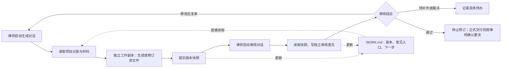

# 同一项目的文本生成、审阅与简易版本管理

## 结论

采用“独立工作副本 → 成对文稿版本快照 → 独立审阅记录 → 修订新版本”的文件方案。律师启动对话；两个 skill 直接读取同一项目的版本与意见。WORK.md 展示当前状态和下一步，正文保持原有核验／纯净双视图。

这里的提交借鉴 push/review 的协作含义，不使用 Git 作为文稿版本系统，不自动上传服务器。审阅过程不改已提交原文，修订在新工作副本进行，形成 v0002 等后续版本。已提交历史保留，避免只有“v2”标注而无法还原 v1 的问题。

## 查证过的现有做法

以下为 2026-09-15 查询的官方文档；是可借鉴机制，不是所有产品的市场排名，也不等同于这些功能已接入本项目。

| 做法 | 官方依据 | 本项目采用方式 |
| --- | --- | --- |
| 具名版本与历史恢复 | [Google Docs 版本历史](https://support.google.com/docs/answer/190843?hl=en) | 为每轮送审保留完整且可定位的版本，工作副本与已提交版本分开。 |
| 版本快照、比较 | [Tiptap Snapshot](https://tiptap.dev/docs/collaboration/documents/snapshot)、[Snapshot Compare](https://tiptap.dev/docs/collaboration/documents/snapshot-compare) | 借鉴快照和独立差异视图；当前先用本地文件，不引入实时协作编辑器及其服务。 |
| 原文不改，差异单独展示 | [Word legal blackline](https://support.microsoft.com/en-us/word/compare-document-differences-using-the-legal-blackline-option) | 保留双文件历史，意见与变更比较放侧边文档；Word 比较可作为后续可选接入。 |
| 批注绑定原句和上下文 | [W3C Web Annotation](https://www.w3.org/TR/annotation-model/#text-quote-selector) | 版本＋文件＋章节＋原句＋前后文联合定位，避免单靠行号；跨版本匹配须复核。 |

对于本次由两个对话轮流生成和审阅的场景，完整快照、分开的意见和明确版本已经能解决主要交接问题。若以后要多人同时改一个富文本文档，再评估 Tiptap/Yjs 等实时编辑方案；它不代替法律审阅、确认和正式交付流程。

## 项目级提示词放在哪里

Codex 官方文档明确支持通过项目 AGENTS.md 传递项目规则，且有目录层级和加载范围。这是项目指令入口，不是用户可以覆盖平台全部规则的系统消息。[官方说明](https://learn.chatgpt.com/docs/agent-configuration/agents-md)

本次提供 [AGENTS.md 入口模板](../templates/legal-project/AGENTS.md) 和 [PROJECT.md 完整协作指令](../templates/legal-project/PROJECT.md)。新事项由配套工具复制到事项根目录；从该目录启动两个对话，使其读取同一套规则。其他宿主有项目指令栏时可使用 PROJECT.md 的内容；仅上传同名文件不证明宿主会自动加载，应实际检查。

项目指令管“读哪些记录、哪个角色写哪个目录、怎样接续与停止”，skill 管“如何写作、核验与判断”，本地程序管“快照保存、基线检查、哈希核对和状态登记”。提示词不是访问控制，不把“不要覆盖”写进提示词就宣称有系统隔离。

## 版本及协作设计

- **工作副本**：每个生成对话有自己的 drafts 目录，可以反复修改；不同对话不共写一对文件。
- **提交版本**：每次冻结两份文稿、BRIEF.md、RESPONSE.md 及证据附件，建立完整文件清单和哈希。生成 v0001、v0002 等；不采用覆盖旧文件再改版本标签的方式。
- **审阅记录**：审阅者读取指定版本，意见放 reviews 的独立文件。完成时封存意见，标明具体检查范围；新意见或纠正结论使用新审阅记录，原记录不覆盖。
- **WORK.md**：自动汇总当前版本、当前审阅状态、历史入口、仍在执行的审阅和下一步。完整意见留在每轮 REVIEW.md／result.json；WORK.md 不承担无限增长的全部正文。
- **乐观并发检查**：生成者提交时，基线必须仍为当前版本；否则重新整合。短时文件锁防两个命令同时改登记表，原子替换保证登记表不会只写一半。
- **过期审阅**：审阅 v0001 期间出现 v0002，v0001 的意见仍可保存，但不能批准 v0002。送审文件发生外部变化时校验失败，不能继续登记为通过。
- **恢复旧内容**：从旧版本创建新工作副本，保留当前基线和内容来源，提交为新版本重新审阅，不删除中间历史。

## 程序边界

配套工具按文件字节保存 Markdown、Word 等文件，不替代文书生成器。自动差异仅对可解码文本输出，Word 等二进制文件显示文件变化并要求按需用文书比较／预览能力核查；不冒充已实现 Word 原生修订、可靠语义差异或页面审阅。

它能检测遵循同一工具的并发提交、已登记文件变化和过期批准；不能阻止具有本机文件写权限的人同时改状态和历史，也不能认证 actor 是真实独立对话。生产企业部署若需要不可篡改留存、身份权限、保留期限、备份及恢复，需接入企业存储和身份体系。这些属于后续基础设施，不把本地轻量工具标为完整企业审计系统。

不按 token 成本裁剪必要证据或意见历史；每轮保留完整可复查材料。自动唤醒另一对话未实现且不是文件共享本身具备的能力，当前由律师启动下一职责，启动后自行读取和写回。

## 本次实际验证

- 15 项本地程序行为测试通过：正常提交／审阅／修订、双生成基线冲突、旧版审阅不批准新版、送审文件和已完成审阅被改动、缺文件及越界路径、同标识自审、未完成检查和阻断问题、批注原句唯一定位、可选文风建议、未完成审阅取消、恢复旧内容为新版本、明确更正旧审阅、文件锁及原子写失败、WORK.md 重建。
- 两个 0.5.0 文本 skill 入口校验通过，共同参考一致且包内引用可解析；项目包的文件内容与源文件一致。
- 从最终项目 ZIP 解包后，使用其中程序实际运行初始化、创建工作副本、提交、启动审阅、写意见、完成登记及读取状态。使用明确标识的合成文本，结论保留 PENDING，因为未执行真实法律审阅。
- 原生图技能与保留的图形规范共 6 个文件的内容哈希与拆分前一致。

这些结果证明本地文件工作流可以运行，不证明目标宿主的指令加载、模型协作、原文检索、Word 页面效果或法律结论已经验证。操作入口见[项目协作操作说明](项目协作操作说明.md)。
