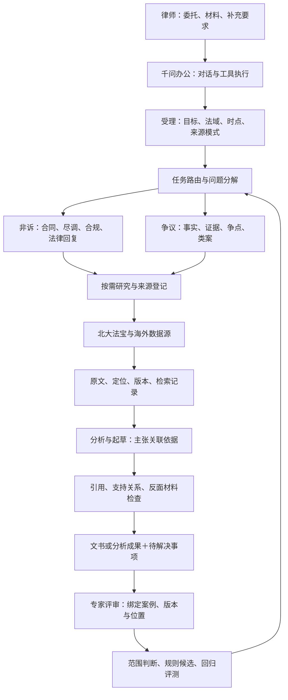

# LexPrism Agent框架

版本：0.1.0-framework｜2026-09-08｜设计与技能初稿，尚未完成千问办公运行验证。

## 1. 产品定位与当前判断

LexPrism是供律师使用的法律工作助手，以约70%的产品投入支持非诉与风险管理，约30%支持争议解决与证据工作。这是开发和评测组合的方向，不是每次回答的篇幅比例。

当前最适合采用“千问办公承载Agent＋LexPrism技能包＋官方数据库MCP＋专家反馈”的结构。千问办公负责对话、模型、文件和工具调用；技能包定义专业流程、交付规范和检查要求；本地目录负责版本维护、测试材料及后续必要的数据库适配。先不开发GUI，也不以自建LangGraph运行服务作为参赛前置条件。

香港问题是一个带律师评语的测试案例，不能决定产品法域或业务边界。后续其他法域、文种和律师的反馈应进入同一套评测机制。

## 2. 现有材料评估

本次依据包括[云端LexPrism文档](https://docs.google.com/document/d/1AMiwVu8vzMgPluXpFTyu3kwwEWuFWrXAt4NdMz89DCY/edit)、[律师提示词汇编](../律师提示词/律师提示词汇编.md)、[报名通知邮件](https://mail.google.com/mail/#all/1a07b087d48c7099)及用户本次补充。未读取其他DOCX。

| 现有资产 | 可用之处 | 转成产品还缺什么 |
| --- | --- | --- |
| 研究、写作、引用与修改要求 | 已经覆盖真实律师工作中的大量痛点；可作为技能方法来源 | 统一任务记录、调用边界、失败状态及交付格式 |
| 来源分级与原文对照要求 | 强调原始依据、定位、翻译、引用可追溯 | 将“来源权威性、语言、时效、支持程度”拆开，外文官方文件不应仅因语言降级 |
| 五份本地提示词 | 可复用材料受限研究、问题分解、官方来源、事实与范例分离等方法 | 默认排除中国法、特殊文风、特定贸易问题等只适用于原任务，不能拼接为全局规则；部分手册依赖未提供模板 |
| 香港回答及13处标注 | 适合观察定位、术语、结构、说理、建议可执行性等失败类型 | 还不能据此计算通过率、证明其他业务能力，或认定专家已确认全部法律结论 |
| 参赛方向 | 可交付一个核心Skill或技能包，并演示完整流程 | 需要在千问办公实际部署、换输入复跑，并保存验证记录 |

判断：已有材料足够启动专业流程设计；尚不足以证明产品效果。当前没有可复现的运行记录、系统化评测结果或数据库接入证据。此次将材料整理为技能与开发约定，不将初稿标成已上线Agent。

## 3. 架构与职责

这些是逻辑职责，不代表已经启动多个独立Agent。首版以同一对话顺序执行为主；宿主具备独立任务能力后，可将检索与复核隔离运行，但必须保存真实工具记录才能声称完成独立复核。

| 模块 | 主要输入 | 交付与下一步条件 |
| --- | --- | --- |
| 受理与路由 | 委托、已有事实、材料权限 | Task：法域、时点、读者、交付物、来源模式；缺少决定性信息才追问 |
| 问题分解 | Task、文件目录 | Issue清单与研究计划；优先处理影响结论的问题 |
| 研究与来源整理 | Issue、工具能力、账号权限 | 来源与原文片段、版本、覆盖缺口；只有摘要时不能冒充读过全文 |
| 非诉分析 | 交易事实、合同、法规、业务偏好 | 风险—依据—影响—修订/行动建议，区分强制要求和商业选择 |
| 争议分析 | 材料、主张、时间信息、类案 | 事实时间线、证据矩阵、争点及反面材料；不自动认定真实性或证明力 |
| 起草与修订 | 分析、文种、指定模板 | 可交付文稿及Claim记录；新材料通过影响关系修订对应结论 |
| 质量复核 | 文稿、Claim、Source、原文 | 引用存在、定位、语义支持、时效/范围检查；失败或未运行必须可辨 |
| 专家反馈 | 案例、运行版本、律师评语 | 保留原评语，记录采纳状态、适用范围及后续回归结果 |

## 4. 业务组合

首轮开发建议以10个评测槽位表达70/30，而非承诺10套完整业务产品：

| 方向 | 首轮槽位 | 典型交付 |
| --- | ---: | --- |
| 合同审阅与风险条款 | 3 | 风险清单、逐条修改建议、待客户确认事项 |
| 尽调与交易/经营合规 | 3 | 缺件清单、义务与风险矩阵、行动清单 |
| 法律研究与客户回复 | 1 | 有引用的回复或专题分析 |
| 事实与证据整理 | 2 | 时间线、事实—证据关联及矛盾/缺口 |
| 争点与类案研究 | 1 | 争点备忘录、有利/不利类案与适用差异 |

这是待准备的评测配额，当前没有10个已标注样本。香港案例按其实际任务归入法律研究/回复槽位，其他槽位逐步由律师提供脱敏材料或明确标记的合成练习填充。所有方向共享研究、引用、写作与复核，避免每个场景复制一整套提示词。

## 5. 任务状态与证据记录

任务通常沿“受理→研究→分析/起草→复核→交付→专家评审”推进。简单材料整理可以跳过外部研究；资料受限任务禁止补外部依据。数据库失败时，保存错误类别、已取得资料和未覆盖问题，交付限定范围的结果或等待必要材料，不伪造成功。

最小对象如下；当前为数据约定，尚无数据库或运行服务实现。

| 对象 | 最小字段与用途 |
| --- | --- |
| Task / Issue | 任务ID、目标、法域、研究日期/法律基准日、来源模式、问题ID、交付物 |
| Source | 来源ID、供应方、原始发布者、标题、法域、文种、发布日期、生效/失效信息、版本、URL、获取时间、可保存范围 |
| Passage | 片段ID、来源ID、原文、定位方式与值、译文标记；PDF页码区分印刷页码和文件页序 |
| Claim | 主张ID、所在段落、事实前提、关联片段、支持/限制/反驳关系、推理说明、核验状态 |
| Draft / Run | 文稿版本、技能版本、宿主与模型可见信息、实际调用、失败、输出位置、时间和可获得的成本 |
| Feedback | 案例/运行/文稿/位置、评语原文、问题类型、建议修订、适用范围、采纳及回归状态 |

引用状态分别记录：资料是否取得、定位是否找到、原文是否支持主张、适用时点是否核对。来源不可用不等于主张错误；检索到案例不等于已完成后续判例效力检查；引用链接存在不等于语义正确。保留“未检查、无法取得、待专家判断”等状态，不能挤进统一的通过/失败。

来源缓存与任务私有资料分开，禁止跨客户串用。缓存键至少包含供应方、文档ID、版本、语言；账号权限变化及版本更新后应重新确认可用性。第三方受限全文按合同授权决定是否保存和多久保存。

## 6. 专家反馈如何进入迭代

保存“原始意见→分类→范围→采纳决定→修订版本→回归结果”。范围至少区分本案、文种、业务、法域、某位律师偏好、全局候选和待确定。一次香港评语可以产生“定位不准确”这一检查项，但不能自动产生其他法域的法律规则。不同律师意见冲突时保留差异，并指定本次采用的文种/偏好。

评测区分开发案例和保留案例。开发案例可用于改技能；保留案例用于检查换材料后的表现。已经看过的香港评语不能再宣称是盲测。最初按案例报告可用性、错误和修改成本，样本不足时不公布泛化准确率。详见[评测约定](../evals/README.md)。

## 7. 现有法律Agent的借鉴

本轮查看了官方仓库的说明及关键工作流/源文件。未运行这些项目，未获得可比较的法律效果成绩；未将其代码复制进本项目。

| 项目 | 实际可借鉴 | 不直接沿用 |
| --- | --- | --- |
| [Anthropic claude-for-legal](https://github.com/anthropics/claude-for-legal) | 合同审阅围绕主协议、附件、客户playbook组织；诉讼chronology保留来源、事件与冲突 | 默认宿主、美国法律语境和客户偏好不应成为LexPrism全局设置；Apache-2.0，实际复制时仍需固定版本并履行许可 |
| [lowtidebuild/legal-research-agent](https://github.com/lowtidebuild/legal-research-agent) | 受理、来源计划、主张核验、分析、输出分阶段；区分真实核验与流程冒烟测试 | 不能仅因主张带may/could等条件词而跳过核验；原生脚注、复杂排版需另验；Apache-2.0 |
| [2249619829/Legal（法智）](https://github.com/2249619829/Legal) | supervisor路由、事实/合同/法律职责划分，以及工具结果回收 | 暂不引入整套运行栈；README功能声明不等于实测质量；本轮未确认开源许可证，未经确认不复制代码 |
| [langgraph_legal_assistant](https://github.com/sergio11/langgraph_legal_assistant) | 用作检索与多角色编排的概念参考 | 仓库定位为个人POC；网页搜索不能替代权威数据库和引用效力核验；MIT |

因此，当前优先借鉴专业工作流和证据结构。只有在千问办公无法保留必要记录、需要稳定自动批测或需要独立系统集成时，再评估轻量Python运行层或LangGraph，而不是提前维护第二套Agent。

## 8. 当前交付边界

已经编写：[技能入口](../skills/lexprism/SKILL.md)、六份按需参考、部署说明、数据库研究、开发排期和反馈模板。尚未完成：真实数据库鉴权、千问办公安装与调用、自动引用验证器、可重复批测、文档导出程序和实际专家通过率。具体工作以[开发计划](开发计划.md)为准。
